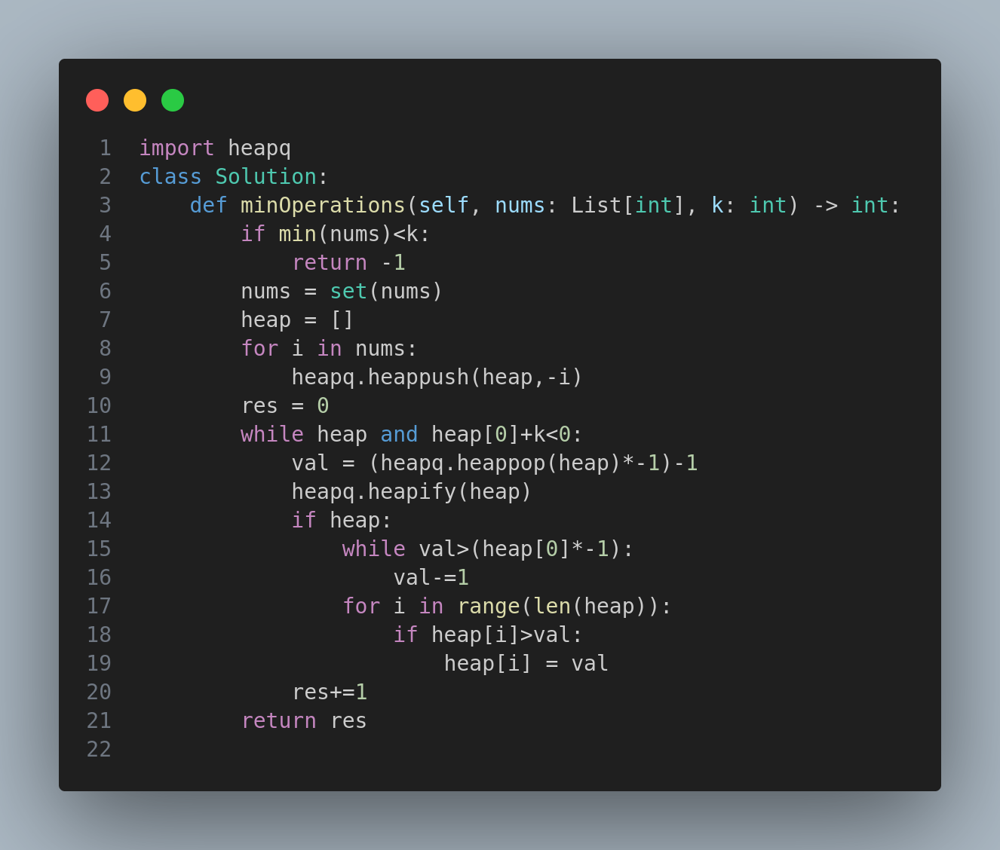

# 3375. Minimum Operations to Make Array Values Equal to K

## Problem Statement

You are given an integer array `nums` and an integer `k`.

An integer `h` is called **valid** if all values in the array that are strictly greater than `h` are identical.

You are allowed to perform the following operation on `nums`:
- Select a valid integer `h`.
- For each index `i` where `nums[i] > h`, set `nums[i]` to `h`.

Return the **minimum number of operations** required to make every element in `nums` equal to `k`. If it is **impossible** to make all elements equal to `k`, return `-1`.

---

## Examples

### Example 1:
**Input:** `nums = [5,2,5,4,5]`, `k = 2`

**Output:** `2`

**Explanation:**
The operations can be performed in order using valid integers 4 and then 2.

---

### Example 2:
**Input:** `nums = [2,1,2]`, `k = 2`

**Output:** `-1`

**Explanation:**
It is impossible to make all the values equal to 2.

---

### Example 3:
**Input:** `nums = [9,7,5,3]`, `k = 1`

**Output:** `4`

**Explanation:**
The operations can be performed using valid integers in the order 7, 5, 3, and 1.

---

## Constraints

- `1 <= nums.length <= 100`
- `1 <= nums[i] <= 100`
- `1 <= k <= 100`

---

## Approach

The key idea is to use a **max heap** to repeatedly reduce the maximum elements of the array to a valid `h`. Here's the strategy:

- If any element in `nums` is **less than** `k`, it's **impossible** to make all elements equal to `k`, so we return `-1`.
- We use a **heap** to always operate on the current maximum value.
- We keep track of operations and reduce values step-by-step to make all elements equal to `k`.

---

## Solution Image

  

This problem challenges your understanding of heaps and greedy strategies when dealing with value equalization across arrays.*

