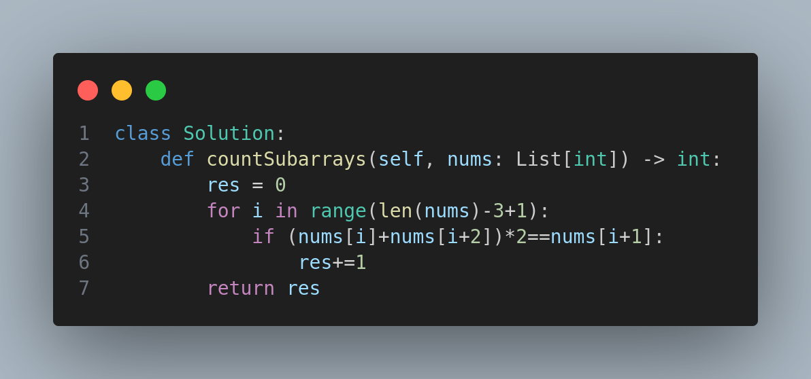

# 3392. Count Subarrays of Length Three With a Condition

## Problem Description
Given an integer array `nums`, return the number of subarrays of length 3 such that the sum of the first and third numbers equals exactly half of the second number.

---

## Example

### Example 1:
- **Input:** `nums = [1,2,1,4,1]`
- **Output:** `1`
- **Explanation:** Only the subarray `[1,4,1]` satisfies the given condition.

### Example 2:
- **Input:** `nums = [1,1,1]`
- **Output:** `0`
- **Explanation:** `[1,1,1]` does not satisfy the condition.

---

## Constraints
- `3 <= nums.length <= 100`
- `-100 <= nums[i] <= 100`

---

## Solution Overview
The idea is to:
- Iterate through all possible subarrays of length 3.
- For each subarray, check if **(first element + third element) * 2 == second element**.
- If yes, increase the count.

> **Note:** The solution code is represented using an `image.png` instead of direct Python code.

  

---

## Tags
- Array
- Sliding Window
- Math

---

