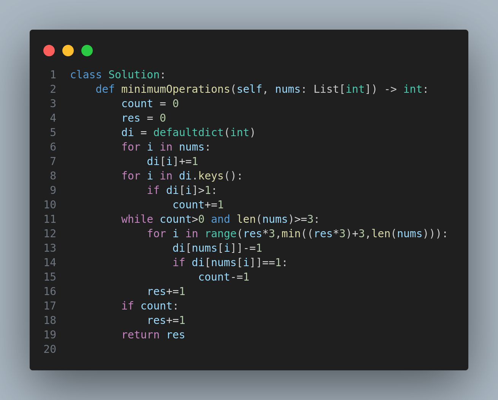

# 3396. Minimum Number of Operations to Make Elements in Array Distinct

## Problem Statement

You are given an integer array `nums`. Your goal is to make all the elements in the array **distinct**. To do this, you are allowed to repeatedly perform the following operation:

- **Remove the first three elements** of the array. If the array has fewer than three elements, remove all of them.

Return the **minimum number of operations** required to make the array elements distinct.

---

## Examples

### Example 1:

**Input:** `nums = [1,2,3,4,2,3,3,5,7]`

**Output:** `2`

**Explanation:**
- Remove the first 3 elements: `[4,2,3,3,5,7]`
- Remove the next 3: `[3,5,7]` — All elements are now distinct.

### Example 2:

**Input:** `nums = [4,5,6,4,4]`

**Output:** `2`

**Explanation:**
- Remove the first 3 elements: `[4,4]`
- Remove remaining elements: `[]`

### Example 3:

**Input:** `nums = [6,7,8,9]`

**Output:** `0`

**Explanation:**
The array already contains distinct elements.

---

## Constraints

- `1 <= nums.length <= 100`
- `1 <= nums[i] <= 100`

---

## Approach

The solution uses a **frequency dictionary** to count how many elements are duplicated. It then removes elements in chunks of 3 from the start of the array and keeps track of the count of remaining duplicates after each removal. The loop continues until all elements are distinct.

- Use a hashmap to count frequencies of all elements.
- Track how many values have duplicates.
- Simulate removals in chunks of 3 from the front.
- Stop once there are no more duplicates or fewer than 3 elements remain.

---

## Code

---

✅ This problem reinforces how to manage array operations and track frequencies efficiently!

