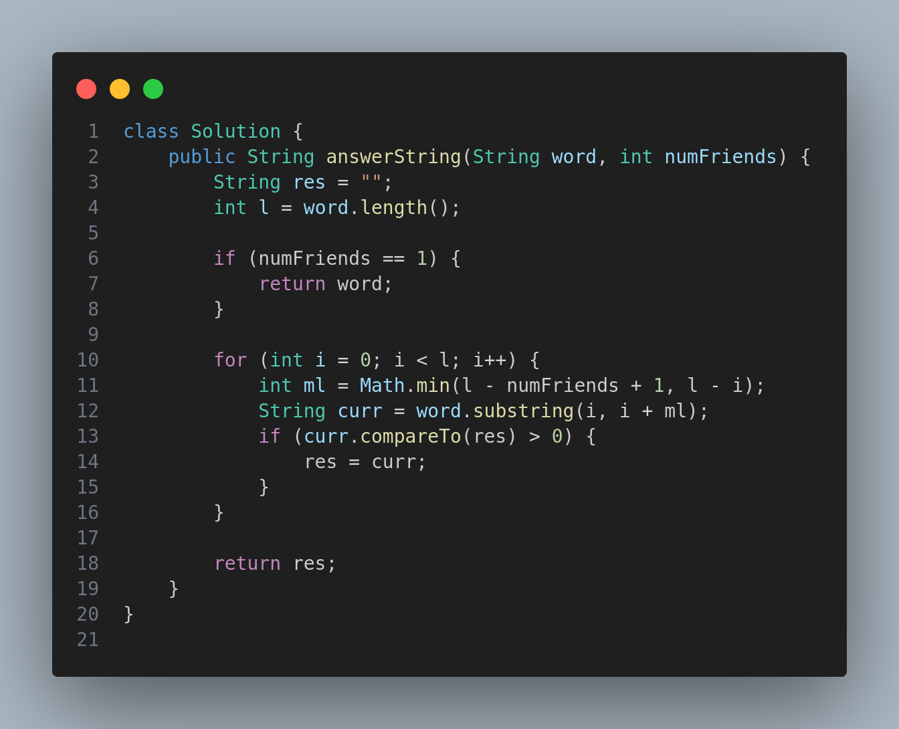

# 3403. Find the Lexicographically Largest String From the Box I

## Problem Statement

You are given a string `word`, and an integer `numFriends`.

Alice is organizing a game for her `numFriends` friends. There are multiple rounds in the game, where in each round:

* `word` is split into `numFriends` non-empty strings, such that **no previous round has had the exact same split**.
* All the split words are put into a box.

Return the **lexicographically largest string** from the box after all the rounds are finished.

## Examples

### Example 1:

**Input:**

```
word = "dbca", numFriends = 2
```

**Output:**

```
"dbc"
```

**Explanation:**
Possible splits:

* "d" and "bca" → box: "d", "bca"
* "db" and "ca" → box: "db", "ca"
* "dbc" and "a" → box: "dbc", "a"

The largest string from the box is **"dbc"**.

### Example 2:

**Input:**

```
word = "gggg", numFriends = 4
```

**Output:**

```
"g"
```

**Explanation:**
The only possible split is "g", "g", "g", "g". The largest string is **"g"**.

---

## Constraints

* `1 <= word.length <= 5000`
* `word` consists only of lowercase English letters.
* `1 <= numFriends <= word.length`

---

## Approach

* If `numFriends == 1`, the only possible split is the full word.
* Iterate through all valid prefix lengths for the first `numFriends - 1` strings.
* At each index, extract the largest possible prefix up to `word.length - numFriends + 1`, which ensures valid splits.
* Track the maximum string found.

---

## Code Implementation (Java)



---

## Complexity Analysis

* **Time Complexity:** O(n), where n is the length of the word.
* **Space Complexity:** O(1), only a few variables are used.

---

## Summary

This problem is about simulating different split combinations of a word and selecting the lexicographically largest substring that appears across all splits.

