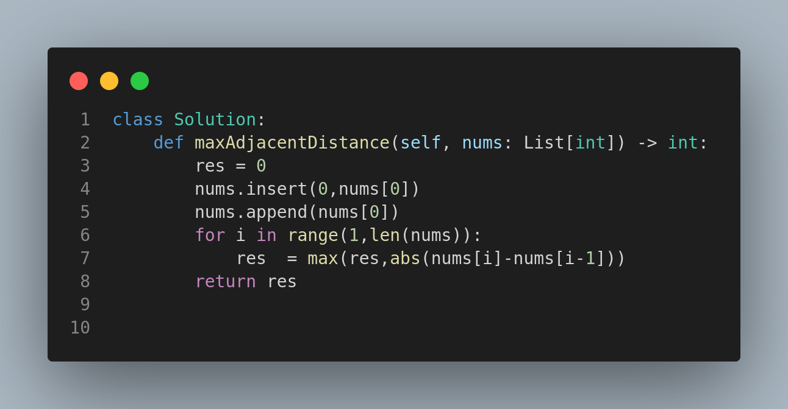

# 3423. Maximum Difference Between Adjacent Elements in a Circular Array

## Problem Statement

Given a circular array `nums`, find the maximum **absolute difference** between adjacent elements.

📌 **Note:** In a circular array, the first and last elements are considered adjacent.

---

## Examples

### Example 1:

**Input:**
```
nums = [1, 2, 4]
```

**Output:**
```
3
```

**Explanation:** `|4 - 1| = 3` is the maximum difference.

### Example 2:

**Input:**
```
nums = [-5, -10, -5]
```

**Output:**
```
5
```

**Explanation:** `|-5 - (-10)| = 5` is the maximum difference.

---

## Constraints

* `2 <= nums.length <= 100`
* `-100 <= nums[i] <= 100`

---

## Approach

1. Iterate through the array.
2. For each element, compute the absolute difference with the next one (with wrap-around).
3. Track and return the maximum of these differences.

This approach ensures we evaluate all adjacent pairs, including the circular ones.

---

## Code



---

## Summary

* This is a simple yet effective problem that focuses on **edge handling in circular arrays**.
* It's important to consider the array's boundaries for a correct solution.
