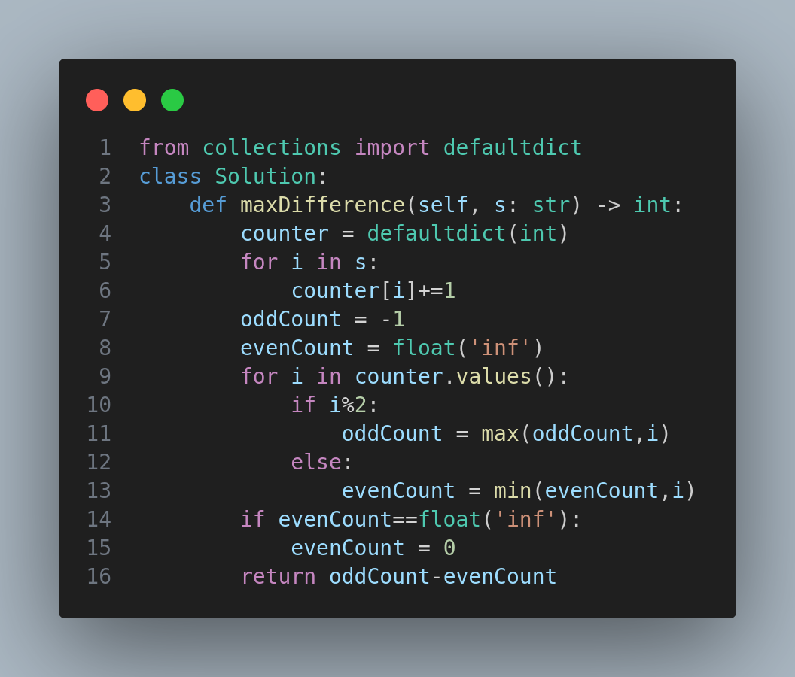

# 386. Lexicographical Numbers

## Problem Statement

Given an integer `n`, return all the numbers in the range `[1, n]` sorted in **lexicographical order**.

You **must write an algorithm that runs in `O(n)` time and uses `O(1)` extra space**.

---

## Example

### Example 1:

**Input:**

```
n = 13
```

**Output:**

```
[1, 10, 11, 12, 13, 2, 3, 4, 5, 6, 7, 8, 9]
```

### Example 2:

**Input:**

```
n = 2
```

**Output:**

```
[1, 2]
```

---

## Constraints

* `1 <= n <= 5 * 10^4`

---

## Optimal Solution Approach

To meet the `O(n)` time and `O(1)` space requirements, we perform a **depth-first traversal** from 1 to n, exploring each number's lexicographical children by multiplying by 10 or incrementing. This avoids creating the entire list upfront and sorting.

---

## Visual Reference



The image above outlines a simple approach but **note that this method does not meet the O(n)/O(1)** constraint. A more optimal DFS approach would be required for large inputs.

---

## Key Takeaways

* Lexicographical order is not the same as numerical order.
* A DFS traversal can efficiently generate such an ordering without full sorting.
* Be mindful of space and time constraints when solving large input problems.

---

⭐ *If you found this helpful or have improvements, feel free to contribute!*
