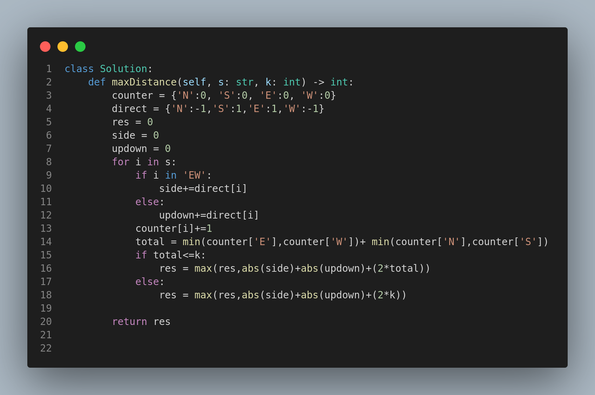

# 3443. Maximum Manhattan Distance After K Changes

## Problem Statement

You are given a string `s` consisting of the characters `'N'`, `'S'`, `'E'`, and `'W'`, representing directions on an infinite grid:

* `'N'`: Move north by 1 unit.
* `'S'`: Move south by 1 unit.
* `'E'`: Move east by 1 unit.
* `'W'`: Move west by 1 unit.

Initially, you are at the origin `(0, 0)`. You can change **at most `k` characters** in the string to any of the four directions.

🔍 **Goal**: Find the **maximum Manhattan distance** from the origin that can be achieved **at any time** while performing the movements **in order**.

📏 **Manhattan Distance** between `(xi, yi)` and `(xj, yj)` is `|xi - xj| + |yi - yj|`.

---

## Examples

### Example 1:

**Input:**

```
s = "NWSE", k = 1
```

**Output:**

```
3
```

**Explanation:**
Change `s[2]` from `'S'` to `'N'` → `s = "NWNE"`.

| Step | Move | Position (x, y) | Distance |
| ---- | ---- | --------------- | -------- |
| 1    | N    | (0, 1)          | 1        |
| 2    | W    | (-1, 1)         | 2        |
| 3    | N    | (-1, 2)         | 3 ✅      |
| 4    | E    | (0, 2)          | 2        |

---

### Example 2:

**Input:**

```
s = "NSWWEW", k = 3
```

**Output:**

```
6
```

**Explanation:**
Change s to "NNWWWW" by altering three directions.
Final position: (-3, 2) → Distance = |−3| + |2| = 5
Intermediate positions may reach distance 6.

---

## Constraints

* `1 <= s.length <= 10^5`
* `0 <= k <= s.length`
* `s` contains only characters `'N'`, `'S'`, `'E'`, `'W'`

---

## Approach Summary

1. Use counters to track the number of movements in each direction.
2. Simulate the movements and track x/y coordinates.
3. At each step, calculate potential increases by using up to `k` changes.
4. Keep track of the maximum Manhattan distance encountered.

---

## Visual Representation



---

## Key Takeaways

* Consider all possible direction reversals for maximization.
* Efficient tracking of position and allowed changes is crucial.
* Optimal for large input sizes due to linear simulation.
