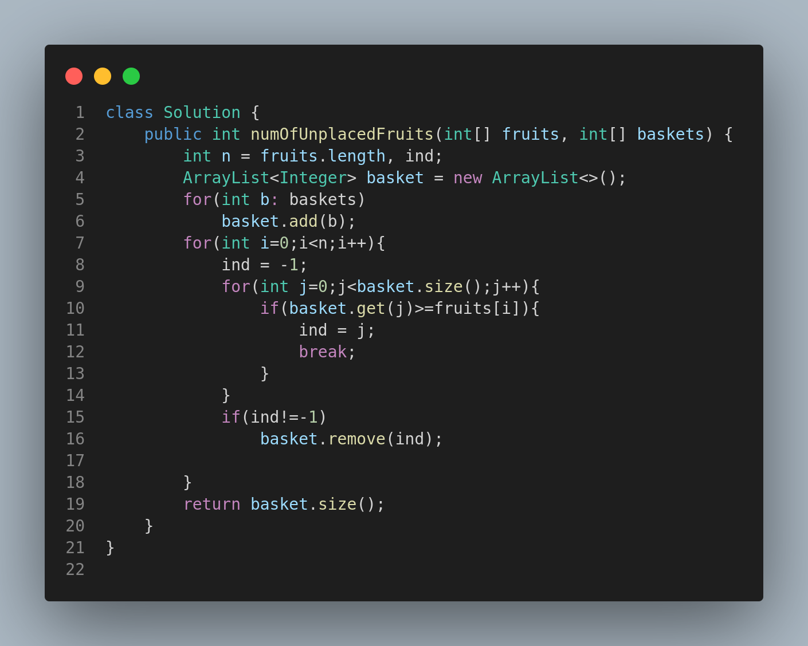

# 🧺 Fruits Into Baskets II

## 📘 Problem Description

You are given two arrays of integers, `fruits` and `baskets`, each of length `n`, where:

* `fruits[i]` represents the quantity of the ith type of fruit.
* `baskets[j]` represents the capacity of the jth basket.

From **left to right**, place the fruits into baskets based on these rules:

1. Each fruit type must be placed in the **leftmost available basket** with a capacity **greater than or equal** to the quantity of that fruit type.
2. Each basket can hold **only one** type of fruit.
3. If a fruit type **cannot be placed**, it remains **unplaced**.

🔚 Return the **number of unplaced fruit types**.

---

## 📥 Input

* `fruits = [4,2,5]`
* `baskets = [3,5,4]`

## 📤 Output

* `1`

---

## ✅ Example Explanation

### Example 1:

```
fruits[0] = 4 → placed in baskets[1] = 5
fruits[1] = 2 → placed in baskets[0] = 3
fruits[2] = 5 → cannot be placed (only basket[2] = 4 left)
=> 1 fruit type is unplaced
```

### Example 2:

```
Input: fruits = [3,6,1], baskets = [6,4,7]
Output: 0
Explanation:
- fruits[0] = 3 → basket[0] = 6
- fruits[1] = 6 → basket[2] = 7
- fruits[2] = 1 → basket[1] = 4
All placed successfully.
```

---

## 🧠 Constraints

* `n == fruits.length == baskets.length`
* `1 <= n <= 100`
* `1 <= fruits[i], baskets[i] <= 1000`

---

## 💡 Approach

We simulate the process:

* For each fruit, find the **leftmost basket** that can fit it.
* If found, remove that basket from availability.
* Count the number of fruit types that couldn’t be placed.

---

## 🖼️ Code (image representation)



---

## 🏁 Output

```java
Input: fruits = [4,2,5], baskets = [3,5,4]
Output: 1
```


