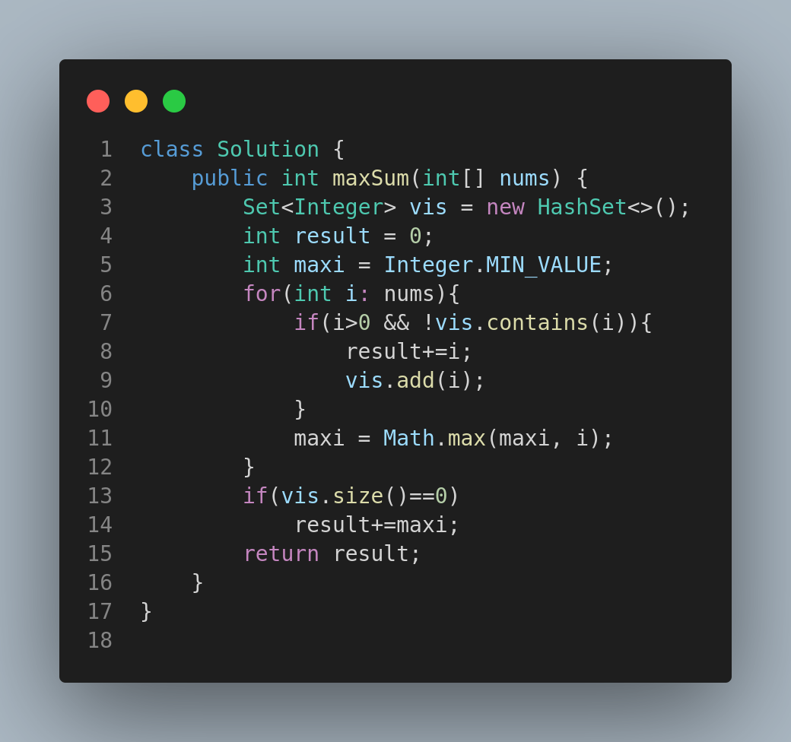

# 3487. Maximum Unique Subarray Sum After Deletion

## Problem Description

You are given an integer array `nums`.

You are allowed to delete **any number of elements** from `nums` without making it empty. After performing the deletions, select a subarray of `nums` such that:

* All elements in the subarray are **unique**.
* The **sum** of the elements in the subarray is **maximized**.

Return the maximum sum of such a subarray.

---

## Examples

### Example 1:

* **Input:** `nums = [1,2,3,4,5]`
* **Output:** `15`
* **Explanation:** Select the entire array without deleting any elements.

### Example 2:

* **Input:** `nums = [1,1,0,1,1]`
* **Output:** `1`
* **Explanation:** Delete all elements except one `1` to get maximum unique subarray sum.

### Example 3:

* **Input:** `nums = [1,2,-1,-2,1,0,-1]`
* **Output:** `3`
* **Explanation:** Delete `-1` and `-2`, and choose subarray `[2, 1]`.

---

## Constraints

* `1 <= nums.length <= 100`
* `-100 <= nums[i] <= 100`

---

## Approach

* Use a HashSet to store visited positive elements.
* Add each unique positive number to the result.
* Track the maximum number to handle the case when all numbers are non-positive.
* If no positive unique elements exist, return the maximum single number.

---

