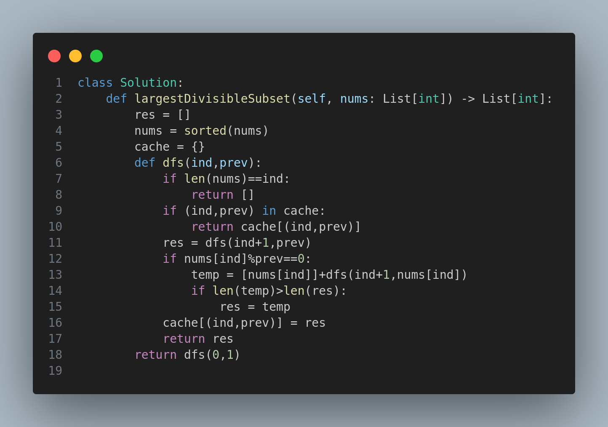

# 368. Largest Divisible Subset

## Problem Statement

Given a set of distinct positive integers `nums`, return the largest subset such that for every pair `(answer[i], answer[j])` in the subset, the following condition holds:

- `answer[i] % answer[j] == 0`, or
- `answer[j] % answer[i] == 0`

If multiple valid solutions exist, return any of them.

---

## Examples

### Example 1:
**Input:** `nums = [1, 2, 3]`

**Output:** `[1, 2]`

**Explanation:** `[1, 3]` is also an acceptable solution as both satisfy the divisibility condition.

### Example 2:
**Input:** `nums = [1, 2, 4, 8]`

**Output:** `[1, 2, 4, 8]`

**Explanation:** All pairs in the subset satisfy the divisibility condition.

---

## Constraints

- `1 <= nums.length <= 1000`
- `1 <= nums[i] <= 2 * 10^9`
- All integers in `nums` are unique.

---

## Approach

This problem is solved using a recursive depth-first search (DFS) combined with memoization to explore all possible divisible subsets.

### Steps:
- Sort the array to ensure order of processing from smaller to larger.
- Use DFS to explore all subsets while maintaining a current divisible chain.
- At each index, either include the number (if divisible with the last number in subset) or skip it.
- Use memoization (`cache`) to avoid recomputation and optimize performance.

This ensures the largest subset where each element is divisible by the previous element in the chain is returned.

---

## Solution Image

  

---

🔍 This is a classic dynamic programming with memoization problem where we build solutions bottom-up using recursive strategies efficiently.

