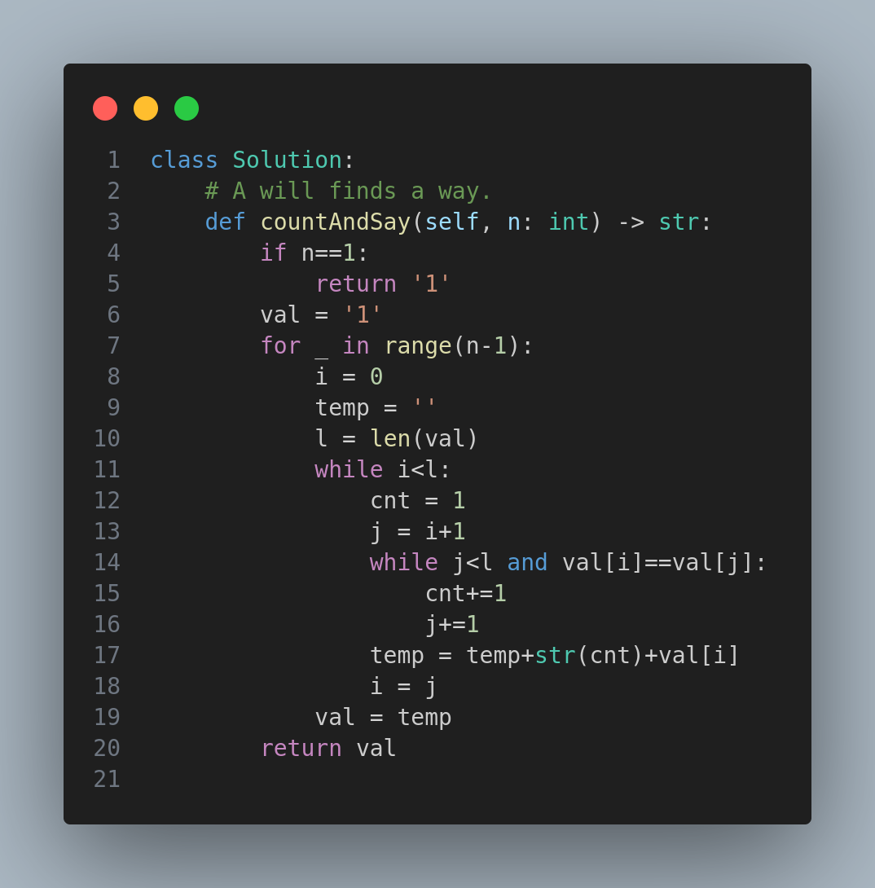

# 38. Count and Say

## Problem Statement

The **Count and Say** sequence is a series of digit strings defined recursively:

- `countAndSay(1) = "1"`
- `countAndSay(n)` is the **run-length encoding (RLE)** of `countAndSay(n - 1)`

The goal is to return the `n`-th element in the Count and Say sequence.

### What is Run-Length Encoding (RLE)?
RLE is a string compression method. It replaces sequences of the same character with the count followed by the character itself.

Example:  
Input: `"3322251"`  
Output after RLE: `"23321511"`  
- "33" → "23"  
- "222" → "32"  
- "5" → "15"  
- "1" → "11"  

---

## Examples

### Example 1
**Input:** `n = 4`  
**Output:** `"1211"`

**Explanation:**  
- `countAndSay(1)` = `"1"`  
- `countAndSay(2)` = `"11"` (one 1)  
- `countAndSay(3)` = `"21"` (two 1s)  
- `countAndSay(4)` = `"1211"` (one 2, one 1)

---

### Example 2
**Input:** `n = 1`  
**Output:** `"1"`  

---

## Constraints

- `1 <= n <= 30`

---

## Approach

1. **Start with "1"** (base case).
2. **Iterate `n-1` times** to build the sequence up to `n`.
3. For each iteration:
   - Traverse the current string.
   - Count consecutive characters.
   - Build the new string using the count and character.
4. Return the result after all iterations.

---

## Code

---
