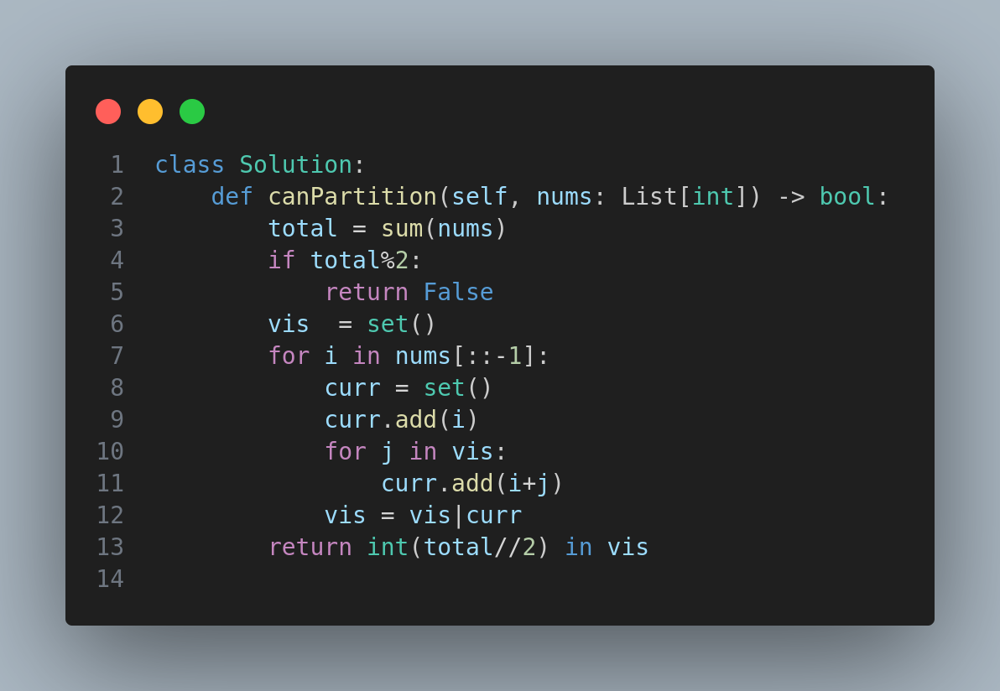

# 416. Partition Equal Subset Sum

## Problem Statement

Given an integer array `nums`, return `true` if the array can be partitioned into two subsets such that the sum of elements in both subsets is equal, otherwise return `false`.

---

## Examples

### Example 1:

**Input:** `nums = [1, 5, 11, 5]`

**Output:** `true`

**Explanation:** The array can be partitioned as [1, 5, 5] and [11].

### Example 2:

**Input:** `nums = [1, 2, 3, 5]`

**Output:** `false`

**Explanation:** The array cannot be partitioned into two subsets with equal sums.

---

## Constraints

- `1 <= nums.length <= 200`
- `1 <= nums[i] <= 100`

---

## Approach

To solve this problem, we:

- First calculate the total sum of the array. If the total is odd, it cannot be split evenly into two parts.
- If the total is even, we attempt to find a subset of the array that sums up to `total // 2`.
- This is done using a dynamic programming (DP) approach with a `set` to keep track of achievable subset sums.
- For each number in `nums`, we update our `set` with new sums formed by adding the current number to existing sums in the set.
- If `total // 2` is in our set at the end, we return `true`.

---

## Code

---

## Complexity Analysis

- **Time Complexity:** O(n * sum/2), where n is the number of elements in the array.
- **Space Complexity:** O(sum/2), due to the use of a set storing subset sums.

---

🧠 *This problem is a classic variation of the subset sum problem and a great use-case for dynamic programming with space optimization!*

