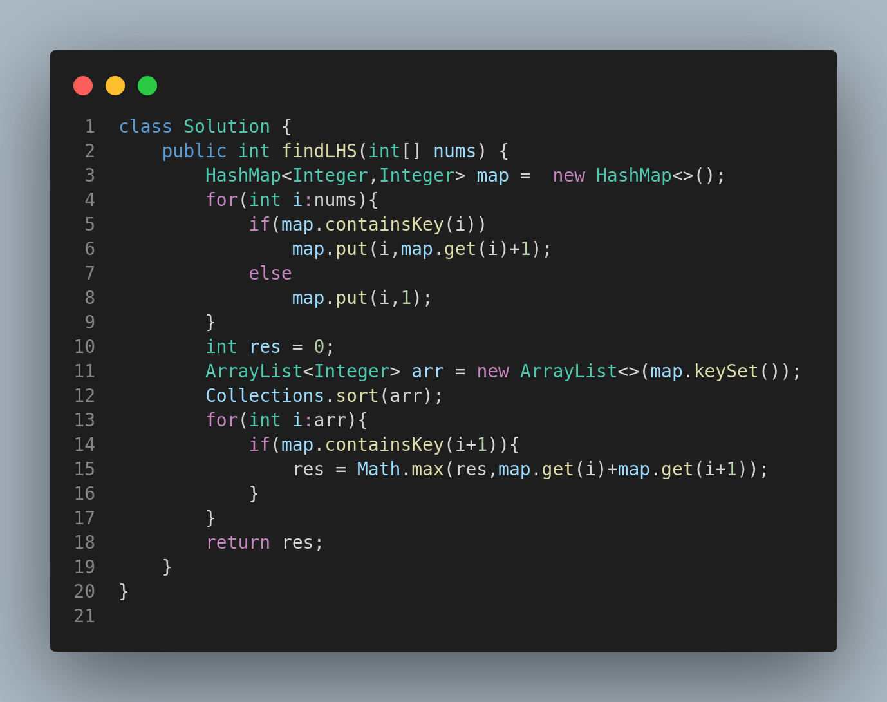

# 594. Longest Harmonious Subsequence

## Problem Statement

We define a **harmonious array** as an array where the difference between its maximum and minimum values is **exactly 1**.

Given an integer array `nums`, return the **length of its longest harmonious subsequence**.

A subsequence is a sequence derived from another sequence where some elements may be deleted without changing the order of the remaining elements.

---

## Examples

### Example 1:

**Input:**

```java
nums = [1,3,2,2,5,2,3,7]
```

**Output:**

```
5
```

**Explanation:**
The longest harmonious subsequence is `[3,2,2,2,3]`.

---

### Example 2:

**Input:**

```java
nums = [1,2,3,4]
```

**Output:**

```
2
```

**Explanation:**
The longest harmonious subsequences are `[1,2]`, `[2,3]`, or `[3,4]`.

---

### Example 3:

**Input:**

```java
nums = [1,1,1,1]
```

**Output:**

```
0
```

**Explanation:**
There are no two values with a difference of 1, so no harmonious subsequence exists.

---

## Constraints

* `1 <= nums.length <= 2 * 10^4`
* `-10^9 <= nums[i] <= 10^9`

---

## Approach

1. Count the frequency of each element in `nums` using a hash map.
2. Iterate over the keys, and for each key `i`, check if `i+1` exists in the map.
3. If it does, consider the combined frequency of `i` and `i+1` as a candidate for the harmonious subsequence.
4. Track and return the maximum such combined frequency.

---

## Code (Visual Reference)



---

## Summary

* A harmonious subsequence must include numbers that differ by exactly 1.
* Efficient frequency counting allows us to solve this problem in linear time.
* Sorting the keys helps avoid unnecessary re-computation.


