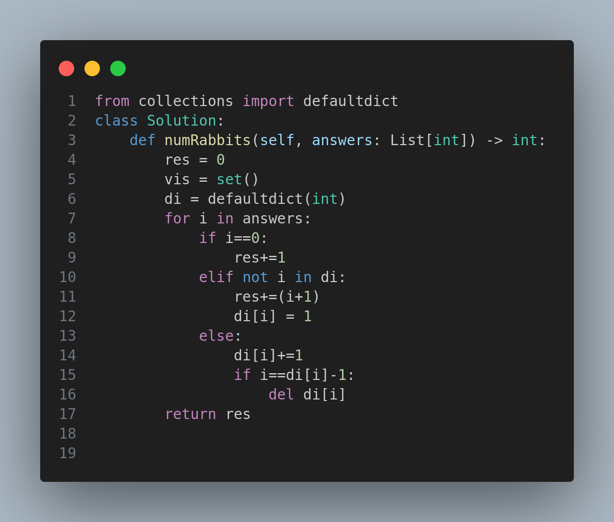

# 🐇 Rabbits in Forest - Problem #781

## 🧠 Problem Statement
There is a forest with an unknown number of rabbits. Each rabbit is asked, "How many other rabbits have the same color as you?" Their responses are stored in an array `answers`, where `answers[i]` is the response of the `i`-th rabbit.

Your task is to return the **minimum** number of rabbits that could be in the forest based on these responses.

---

## 💡 Approach
The core idea is that if a rabbit says there are `x` other rabbits like them, then they belong to a group of size `x + 1`. Multiple rabbits with the same answer can be part of the same group *only* up to `x + 1` members.

### ✅ Logic:
- For every rabbit's answer `i`:
  - If `i == 0`, it means the rabbit is unique; increment result by 1.
  - If `i` is not yet seen, a new group starts with size `i + 1`, so add `i + 1` to result.
  - For repeated `i`, count how many rabbits belong to the current group. Once the count reaches `i + 1`, start a new group.

This logic ensures that we don't overestimate the number of rabbits and group them optimally.

---

## 🧪 Examples

### Example 1:
**Input:** `answers = [1, 1, 2]`

**Output:** `5`

**Explanation:**
- Two rabbits said "1" → they can be in the same color group (2 total).
- One rabbit said "2" → it needs 2 more (3 total).
- Total rabbits = 2 (from 1's) + 3 (from 2) = 5

---

### Example 2:
**Input:** `answers = [10,10,10]`

**Output:** `11`

**Explanation:**
- Each rabbit said 10 → needs a group of 11 rabbits.
- Three rabbits cannot form a full group, so we still need to assume there are 11 total.

---

## 📈 Time & Space Complexity
- **Time Complexity:** `O(n)` - where `n` is the length of `answers`
- **Space Complexity:** `O(n)` - for the hashmap tracking rabbit group sizes

---

## 📷 Code Snapshot

---

## 🔗 Related Topics
- Hash Table
- Greedy
- Counting

---

## 🚀 Final Notes
This problem tests your understanding of greedy grouping and counting with constraints. Think of each rabbit's answer as defining a group capacity and track how full each group is!

Happy Coding! 🧠💻

